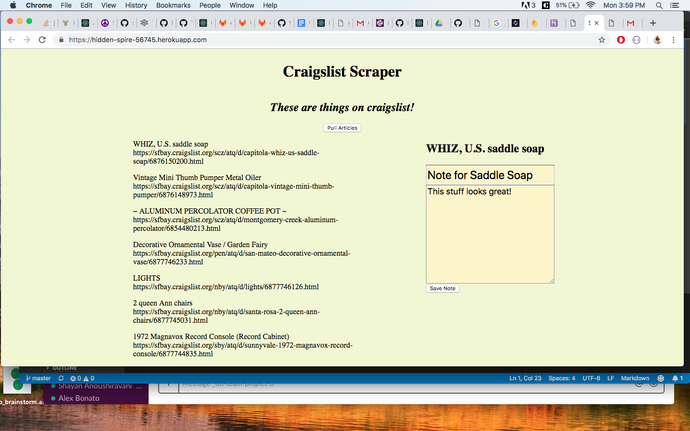
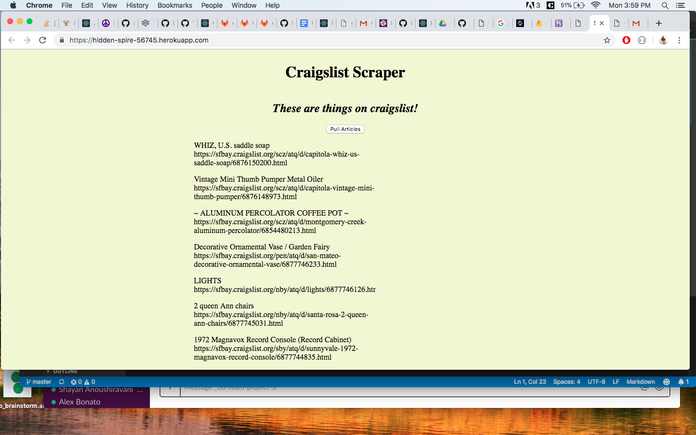
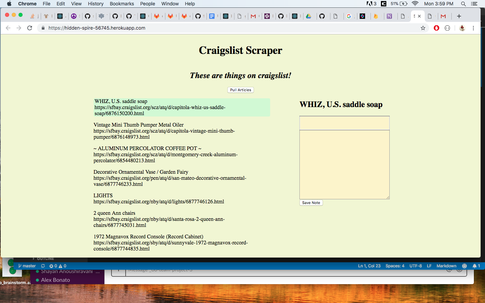

## Craigslist Antique Scraper App

* We will need NPM packages. Clone down the repo to a local directory, and from your bash please navigate over to the "scrapehw" folder in your terminal, and type in your command line: "npm install"

* Once you have installed all of the NPM packages needed, you can then run the line of code: "node server.js" to start up our server, which will say "Connected on 3000" if you are succesfully connected. Then, you would open up your browser and go to https://localhost:3000/

* Upon landing, you will see all the scraped articles from the Antiques section of Craigslist.org, and when you click the article you will be able to save a note to that specific article. The comment is stored in the Mongo database. 

# Author
Shayan Anoushiravani :cat:  https://github.com/shayansea  |Shayan is a Bay Area native and UC Davis graduate in Design, who enjoys the outdoors and art. He is currently on the path to becoming a combo of UX designer, graphic designer, and software developer. | Shayan has an amazing cat named Phineas. :cat: | Drawing, Cooking, Gardening :herb: |